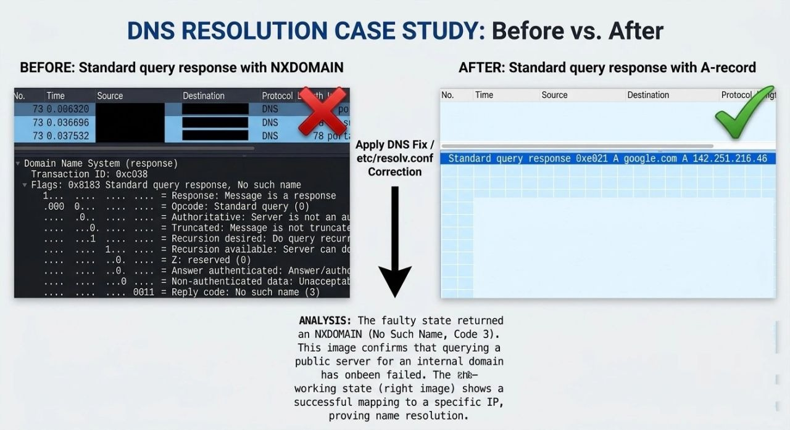
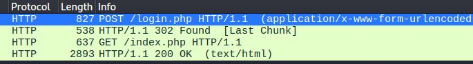
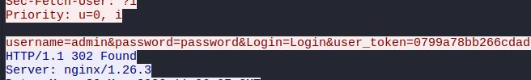

# Week 1 — Network Traffic Analysis & Fundamentals

## Overview
Hands-on network traffic analysis using Wireshark in a Kali Linux 
lab environment. Captured and analysed real protocols to understand 
normal behaviour and identify security risks.

**Tools Used:** Wireshark, Kali Linux  
**Environment:** Local lab — Kali Linux + Windows IIS Server

---

## Protocols Analysed

- DNS — Domain Name System, query and response capture
- TCP — 3-way handshake analysis
- HTTP — Plaintext credential exposure
- ICMP — Ping and traceroute
- ARP — ARP spoofing risk demonstration

---

## Screenshots

### DNS Resolution

### HTTP Login Sequence

### Plaintext Credential Exposure

---

## Key Findings

- HTTP transmits credentials in plain text — visible in Wireshark
- ARP has no authentication — vulnerable to spoofing attacks
- DNS can be spoofed to redirect users to malicious servers
- TCP SYN Flood can cause Denial of Service

---

## Full Analysis
[View Full Wireshark Analysis](./wireshark_week1_analysis.md)
