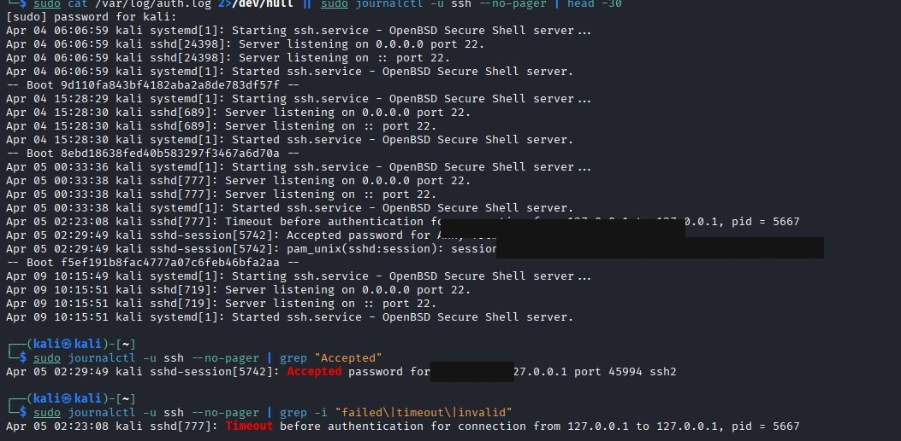
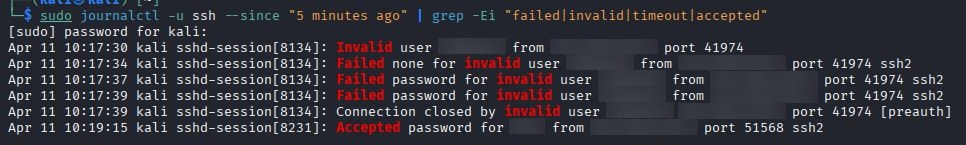
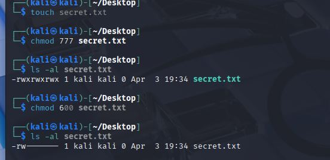

# Week 2 — Linux & SSH Log Analysis

## Overview
Investigated SSH authentication logs on a live Linux machine 
to practice real SOC analyst skills.

**Tools Used:** Kali Linux, journalctl, grep, cat, last, who  
**Environment:** Local Kali Linux machine

---

## Screenshots

### Full SSH Log Reading

### Journalctl — Failed and Invalid Login Detection

### SSH Login Analysis Summary

### File Permission Management

---

## What I Did
- Parsed SSH authentication logs using journalctl and grep
- Reconstructed attack timeline from log entries
- Identified suspicious login events and failed attempts
- Pivoted between entities to trace attacker behaviour

---

## Key Findings
- Identified failed login attempts indicating brute force activity
- Found timeout before authentication — suspicious connection
- Detected accepted password confirming successful login
- Demonstrated file permission hardening using chmod

---

## Full Analysis
[View Full SSH Log Analysis](./ssh_log_analysis_week2.md)
